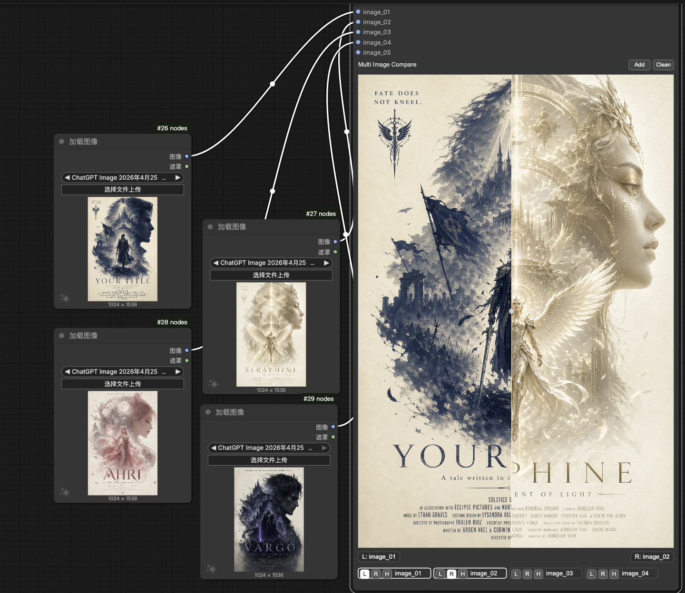
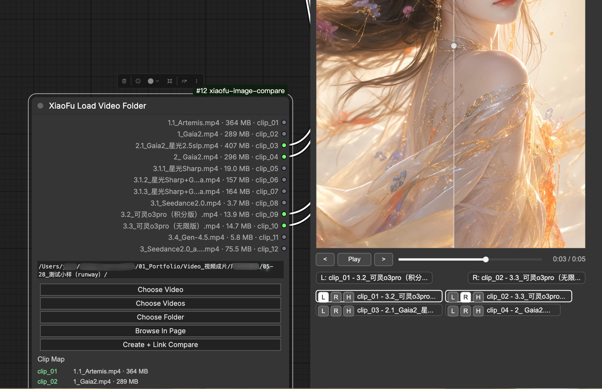

# XiaoFu Image & Video Compare

ComfyUI custom nodes for comparing generated images and local videos with an interactive split-view preview.

This plugin started as an image comparison node. It now includes a full video comparison workflow with local file/folder loading, original-video playback, keyboard controls, and a one-click helper for creating the compare node.

## Nodes

### 🌟 XiaoFu Multi Image Compare

- Compare two selected images with a vertical draggable divider.
- Connect multiple `IMAGE` outputs from ComfyUI's built-in `Load Image` nodes.
- Pick the left and right comparison images with `L` and `R`.
- Hide or show items with `H` / `S`.
- Add more `image_XX` inputs with `Add`.
- Remove unused empty inputs with `Clean`.
- Classic ComfyUI nodes are recommended for the most stable experience.
- Nodes 2.0 is best-effort supported, but may have minor display or interaction compatibility issues depending on the ComfyUI frontend version.



### 🌟 XiaoFu Multi Video Compare

- Compare two selected videos with the same split-view divider.
- Connect videos through `clip_01`, `clip_02`, and more `clip_XX` slots.
- Use the timeline scrubber, previous/next buttons, or keyboard shortcuts to inspect frames.
- Press `Space` to play or pause.
- Press `Left` / `Right` to step backward or forward by one frame.
- Local folder videos use original-file playback, so the preview keeps the source video timing and quality.
- Frame-batch inputs from other nodes still work as a fallback preview mode.

### 🌟 XiaoFu Load Video Folder

- Choose one video, multiple videos, or a whole folder from macOS Finder or the Windows file picker.
- Output up to twelve local video sources as `clip_01` through `clip_12`.
- Show each video's filename and file size directly beside the output port.
- Use `Create + Link Compare` to create a `Multi Video Compare` node and add one starter link automatically.
- Use `Clear Links` to remove all outgoing links from the loader without losing the selected videos.
- Use `Browse In Page` as a fallback browser if the native picker is unavailable.



## Installation

Clone this repository into your ComfyUI `custom_nodes` directory:

```bash
cd ComfyUI/custom_nodes
git clone https://github.com/Yifo98/xiaoFu-Image-Video-Comparegit
```

Then restart ComfyUI.

You should see a startup line similar to:

```text
[XiaoFu Image & Video Compare] Loaded: 🌟 XiaoFu Multi Image Compare, 🌟 XiaoFu Multi Video Compare, 🌟 XiaoFu Load Video Folder
```

## Image Workflow

1. Add one or more ComfyUI `Load Image` nodes.
2. Add `🌟 XiaoFu Multi Image Compare` from `🌟 XiaoFu/Image`.
3. Connect the image outputs into `image_01`, `image_02`, and more slots.
4. Run the workflow.
5. Use `L` and `R` to choose the two images to compare.
6. Move the mouse over the preview to slide the divider.

## Video Workflow

The easiest workflow is to start from the folder loader:

1. Add `🌟 XiaoFu Load Video Folder` from `🌟 XiaoFu/Video`.
2. Click `Choose Video`, `Choose Videos`, or `Choose Folder`.
3. After the videos appear on the loader, click `Create + Link Compare`.
4. Connect any additional `clip_XX` outputs you want to compare.
5. Run the workflow.
6. Click `Play` or press `Space` to start playback.
7. Use `L` and `R` in the compare node to choose which two videos are shown.

Important: after running the video workflow, the preview may stay black until playback starts. Press `Space` or click `Play` once to show the original-video preview.

## Large Local Videos

For large videos, use `🌟 XiaoFu Load Video Folder` instead of browser upload nodes.

The loader registers local file references and streams the original video to the preview UI. This avoids browser upload size limits and avoids decoding large videos into image batches just to compare them.

The loader currently exposes the first twelve matching videos as:

```text
clip_01
clip_02
...
clip_12
```

The output labels include filename and size, so it is easier to match each port to the video you selected.

## Controls

| Control | Action |
| --- | --- |
| `Play` / `Pause` | Start or pause video playback |
| `<` / `>` | Step backward or forward |
| `Space` | Play or pause |
| `Left` / `Right` | Step one frame backward or forward |
| `L` / `R` | Choose the left or right comparison item |
| `H` / `S` | Hide or show an item |

## Notes

- The node category is shown as `🌟 XiaoFu`, so it is easy to find in the ComfyUI node menu.
- Recommended: use the classic ComfyUI node interface when possible.
- Nodes 2.0 can work, but it may have compatibility issues with widget layout, preview refresh, or interactions in some frontend versions. These issues do not affect the underlying workflow execution.
- Classic nodes use a canvas widget.
- Nodes 2.0 uses a dedicated DOM widget as a compatibility layer for buttons, sliders, and video playback.
- Local video playback uses the browser video element and the original local file.
- PyAV is optional for local playback, but helps read exact metadata such as FPS, duration, and dimensions.
- If ComfyUI runs on a remote machine, the file picker and fallback browser operate on that machine's filesystem.

## Compatibility

Tested locally with:

- ComfyUI `0.22.2`
- ComfyUI frontend `1.42.15`
- Python `3.12`

The plugin should also work in other recent ComfyUI versions that support custom nodes with `NODE_CLASS_MAPPINGS` and frontend extensions through `WEB_DIRECTORY`.

## License

Choose and add a license before publishing if you want other people to reuse, modify, or redistribute the code clearly.
